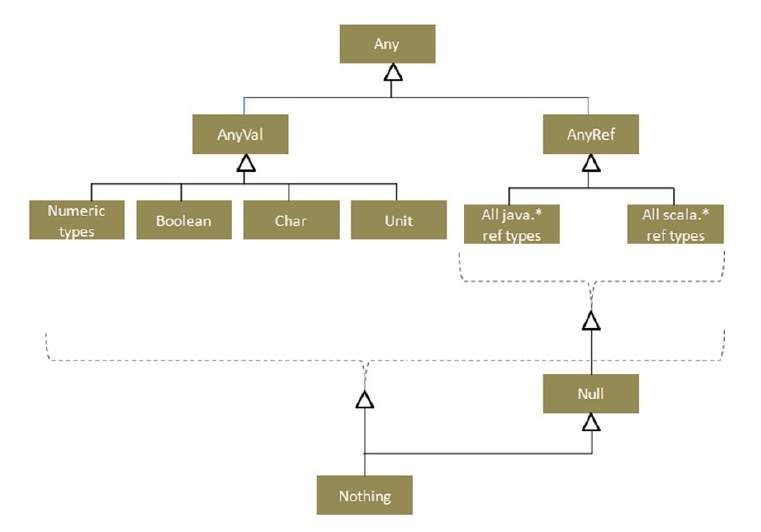

**Chapter 02 Basics of Scala**

<!-- vim-markdown-toc GFM -->

* [Variables](#variables)
* [Scala Type Hierarchy](#scala-type-hierarchy)
* [Arrays, Lists, Ranges, and Tuples](#arrays-lists-ranges-and-tuples)
    * [Arrays](#arrays)
    * [Lists](#lists)
    * [Ranges](#ranges)
    * [Tuples](#tuples)
* [Built-in Control Structures](#built-in-control-structures)
* [Comments](#comments)

<!-- vim-markdown-toc -->
# Variables
- `val`
- `var`

# Scala Type Hierarchy
<div align="center">
    
</div>

- `Any`, `AnyVal`, `AnyRef`
- Numeric
    - `Byte` `Short` `Int` `Long` `Float` `Double`
- `Boolean`
- `Char`
- `Unit`
- `Null`
- `Noting`


# Arrays, Lists, Ranges, and Tuples
## Arrays
```scala
scala> var books:Array[String] = new Array[String](3)
books: Array[String] = Array(null, null, null)

scala> var books = new Array[String](3)
books: Array[String] = Array(null, null, null)

scala> var books = Array("Beginning Scala", "Beginning Java", "Beginning Grooy")
books: Array[String] = Array(Beginning Scala, Beginning Java, Beginning Grooy)

scala> books(0)
res0: String = Beginning Scala

scala> println(books(0))
Beginning Scala
```

## Lists
```scala
scala> val empty:List[Nothing] = List()
empty: List[Nothing] = List()

scala> val books: List[String] = List("Beginning Scala", "Beginning Groovy", "Beginning Java")
books: List[String] = List(Beginning Scala, Beginning Groovy, Beginning Java)

scala> val empty = Nil
empty: scala.collection.immutable.Nil.type = List()

scala> books.head
res2: String = Beginning Scala

scala> books.tail
res3: List[String] = List(Beginning Groovy, Beginning Java)
```

## Ranges
```scala
scala> 1 until 5
res1: scala.collection.immutable.Range = Range(1, 2, 3, 4)

scala> 1 to 20 by 4
res2: scala.collection.immutable.Range = Range(1, 5, 9, 13, 17)
```

## Tuples
Tuple 是有序集合。不像 Array，在 tuple 中不能通过元素迭代。在离散分组时 tuple 很有用，创建 tuple 的两种方式：
- 括号包裹，并通过都好分隔
- 使用箭头操作（`->`）
```scala
scala> val tuple = (1, false, "Scala")
tuple: (Int, Boolean, String) = (1,false,Scala)

scala> val tuple2 ="title" -> "Beginning Scala"
tuple2: (String, String) = (title,Beginning Scala)

scala> val third = tuple._3
third: String = Scala
```
# Built-in Control Structures
- if
- while
- for
- yield
- try
- match


# Comments
- `//`
- `/* ... */`
