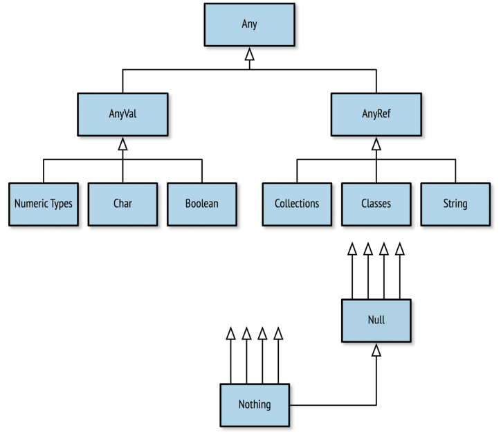

**Chapter 2 Working with Data: Literals, Values, Variables, and Types**


<!-- vim-markdown-toc GFM -->

* [Values](#values)
* [Variables](#variables)
* [Naming](#naming)
* [Types](#types)
    * [Numeric Data Types](#numeric-data-types)
    * [Strings](#strings)
    * [An Overview of Scala Types](#an-overview-of-scala-types)
    * [Tuples](#tuples)
* [Summary](#summary)
* [Exercises](#exercises)

<!-- vim-markdown-toc -->

# Values
Values are immutable, typed storage units, and by convention are the default method for storing data. You can define a new value using the val keyword.
```scala
scala> val x: Int = 20
x: Int = 20

scala> val greeting: String = "Hello, world"
greeting: String = Hello, world

scala> val atSymbol: Char = '@'
atSymbol: Char = @
```
# Variables
```scala
scala> var x = 5
x: Int = 5

scala> x = x * 4
mutated x

scala> x
res2: Int = 20
```
# Naming

```scala
scala> val π = 3.14159
π: Double = 3.14159

scala> val $ = "USD currency symbol"
$: String = USD currency symbol

scala> val o_O = "Hmm"
o_O: String = Hmm

scala> val 50cent = "$0.50"
           ^
       error: Invalid literal number

scala> val a.b = 25
           ^
       error: not found: value a
```

# Types
## Numeric Data Types

```scala
scala> val b: Byte = 10
b: Byte = 10

scala> val s: Short = b
s: Short = 10

scala> val b: Byte = 10
b: Byte = 10
```
Scala does not allow automatic conversion from higher ranked types to lower ranked types. This makes sense, because you could otherwise lose data if you convert to a type with less storage.
```scala
scala> val l: Long = 20
l: Long = 20

scala> val i: Int = l
                    ^
       error: type mismatch;
        found   : Long
        required: Int
```
You can choose to manually convert between types using the *toType* methods available on all numeric types. Although this makes it possible to lose data by converting to a lesser ranked type, it is useful when you know that the data is compatible with the lower ranked type.

```scala
scala> val l: Long = 20
l: Long = 20

scala> val i: Int = l.toInt
i: Int = 20
```
Let’s try out these literals by assigning them to new values without stating the type. The Scala REPL will use type inference to calculate the appropriate types for each value:

```scala
scala> val anInt = 5
anInt: Int = 5

scala> val yellowRgb = 0xffff00
yellowRgb: Int = 16776960

scala> val id = 100L
id: Long = 100

scala> val pi = 3.1416
pi: Double = 3.1416
```


## Strings


```scala
scala> val hello = "Hello There"
hello: String = Hello There

scala> val signature = "With Regards, \nYour friend"
signature: String =
With Regards,
Your friend
```


```scala
scala> val greeting = "Hello, " + "World"
greeting: String = Hello, World

scala> val matched = (greeting == "Hello, World")
matched: Boolean = true

scala> val theme = "Na " * 16 + "Batman!" // what do you expect this to print?
theme: String = Na Na Na Na Na Na Na Na Na Na Na Na Na Na Na Na Batman!

scala> val greeting = """She suggested reformatting the file
     | by replacing tabs (\t) with newlines (\n);
     | "Why do that?", he asked. """
greeting: String =
"She suggested reformatting the file
by replacing tabs (\t) with newlines (\n);
"Why do that?", he asked. "
```

**String interpolation**
```scala
scala> val approx = 355/113f
approx: Float = 3.141593

scala> println("Pi, using 355/113, is about " + approx + ".")
Pi, using 355/113, is about 3.141593.

scala> println(s"Pi, using 355/113, is about $approx." )
Pi, using 355/113, is about 3.141593.
```
```scala
scala> val item = "apple"
item: String = apple

scala> s"How do you like them ${item}s?"
res3: String = How do you like them apples?

scala> s"Fish n chips n vinegar, ${"pepper "*3}salt"
res4: String = Fish n chips n vinegar, pepper pepper pepper salt
```

**Regular expressions**

```scala
scala> "Froggy went a' courting" matches ".*courting"
res6: Boolean = true

scala> "milk, tea, muck" replaceAll ("m[^ ]+k", "coffee")
res12: String = coffee, tea, coffee

scala> "milk, tea, muck" replaceFirst ("m[^ ]+k", "coffee")
res13: String = coffee, tea, muck
```

**Syntax: Capturing Values with Regular Expressions**
```scala
scala> val input = "Enjoying this apple 3.14159 times today"
input: String = Enjoying this apple 3.14159 times today

scala> val pattern = """.* apple ([\d.]+) times .*""".r
pattern: scala.util.matching.Regex = .* apple ([\d.]+) times .*

scala> val pattern(amountText) = input
amountText: String = 3.14159

scala> val amount = amountText.toDouble
amount: Double = 3.14159
```
## An Overview of Scala Types
<div align="center">
    
</div>

## Tuples
**Syntax: Create a Tuple**
```
( <value 1>, <value 2>[, <value 3>...] )
```

```scala
scala> val info = (5, "Korben", true)
info: (Int, String, Boolean) = (5,Korben,true)

scala> val name = info._2
name: String = Korben

scala> val red = "red" -> "0xff0000"
red: (String, String) = (red,0xff0000)

scala> val reversed = red._2 -> red._1
reversed: (String, String) = (0xff0000,red)
```
# Summary
# Exercises
